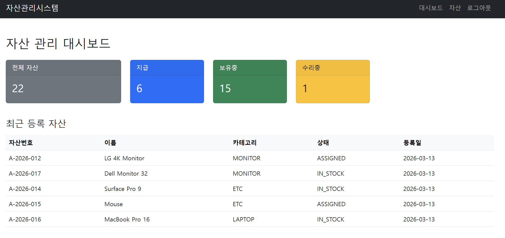
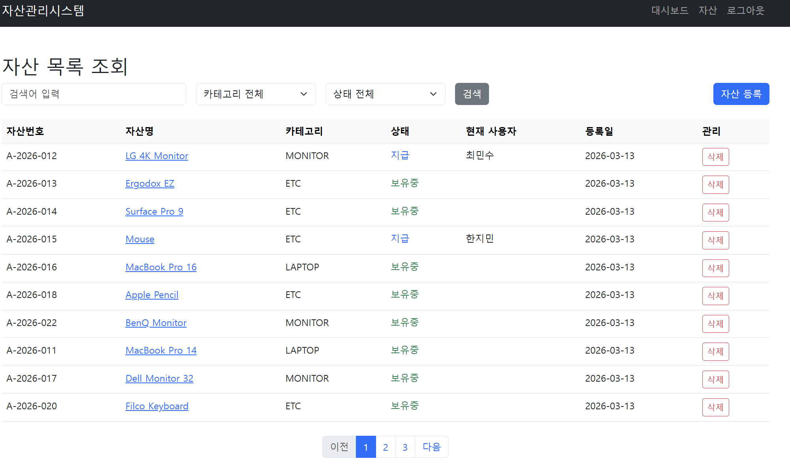
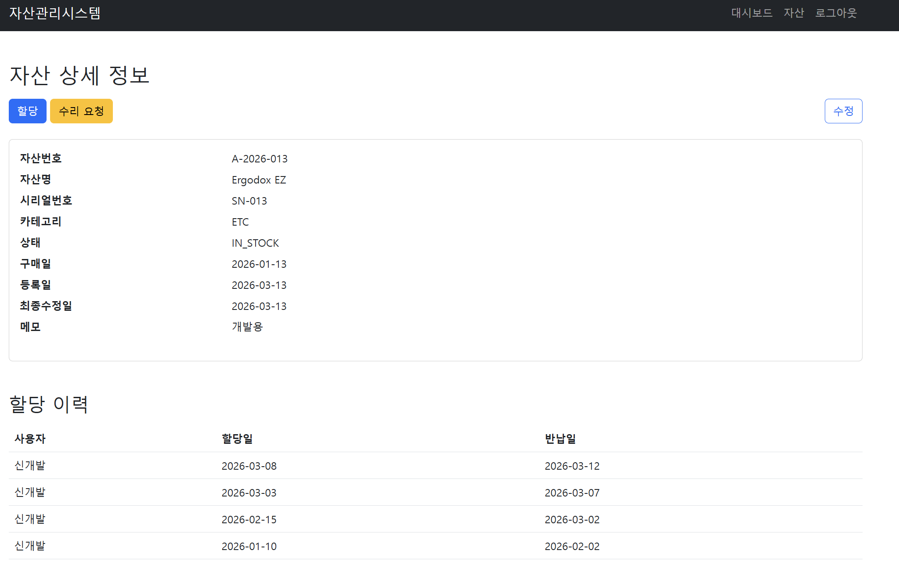
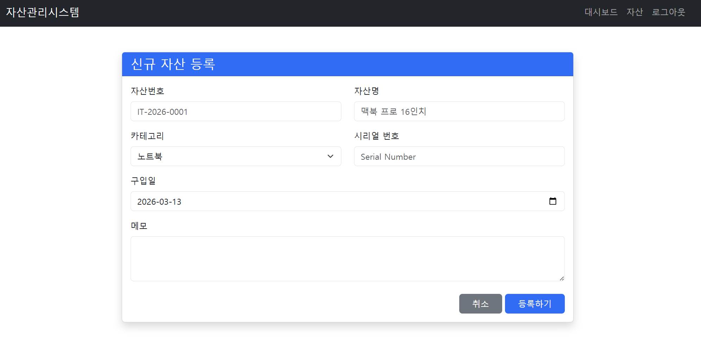
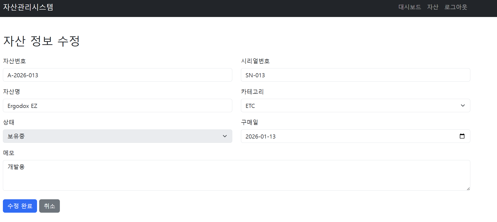
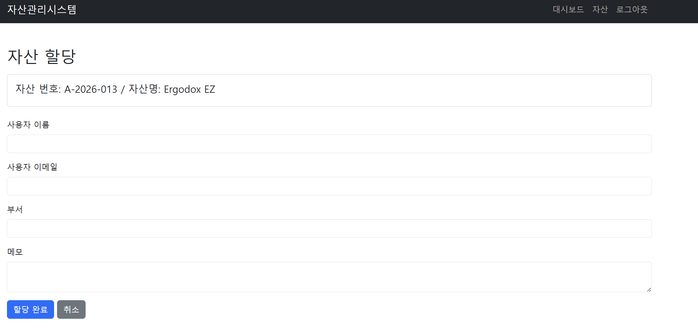

# 자산 관리 시스템 (Asset Management)

Spring Boot + Thymeleaf 기반의 자산 관리 웹 애플리케이션입니다.

---

## 기술 스택

- Java 17
- Spring Boot 3.5.11
- Gradle
- Spring Security
- Spring Data JPA + QueryDSL
- Thymeleaf
- H2 Database (In-Memory)
- MapStruct, Lombok

---

## 실행 방법

### 1. 프로젝트 클론
```bash
git clone https://github.com/jeonmoo/asset-management.git
cd assetManagement
```

### 2. 빌드
```bash
./gradlew clean build
```

### 3. 실행
```bash
./gradlew bootRun
```

또는 빌드된 JAR 파일 실행:
```bash
java -jar build/libs/assetManagement-0.0.1-SNAPSHOT.jar
```

### 4. 접속

- 애플리케이션: [http://localhost:8080](http://localhost:8080)
- H2 콘솔: [http://localhost:8080/h2-console](http://localhost:8080/h2-console)
    - JDBC URL: `jdbc:h2:mem:assetdb`
    - Username: `sa`
    - Password: _(없음)_

---

## 기본 계정

| 구분 | 값 |
|------|----|
| 아이디 | `admin@company.com` |
| 비밀번호 | `admin1234` |

---

## 초기 시드 데이터 쿼리 위치
```bash
src/main/resources/data.sql
```

---

## 📋 주요 기능 및 화면

프로젝트의 핵심 기능들을 화면별로 요약하였습니다.

### 1. 자산 관리 대시보드 (Dashboard)
* **전체 현황 파악:** 자산 총계, 지급 상태, 보유 중, 수리 중 상태를 카드 형태로 시각화.
* **최근 등록 자산:** 가장 최근에 등록된 자산 목록을 우선적으로 확인하여 관리 효율 증대.

### 2. 자산 목록 조회 (Asset List)
* **통합 검색:** 검색어 입력창을 통해 자산번호 및 자산명 검색.
* **필터링:** 카테고리별(MONITOR, LAPTOP, ETC 등) 및 상태별(지급, 보유 중 등) 상세 필터링 제공.
* **페이지네이션:** 대량의 자산을 효율적으로 조회하기 위한 페이징 처리.
* **바로가기:** 자산 상세 정보 페이지로 이동하거나 삭제 기능 제공.

### 3. 자산 라이프사이클 관리 (CRUD)
* **신규 자산 등록:** 자산번호, 명칭, 카테고리, 시리얼번호, 구입일 등을 입력하여 신규 자산 추가.
* **상세 조회 및 상태 관리:** 자산의 상세 정보를 확인하고 '할당' 또는 '수리 요청' 버튼을 통해 상태 변경.
* **정보 수정:** 자산의 기본 정보가 변경되었을 경우 수정 페이지를 통해 내용 업데이트.

### 4. 자산 할당 및 이력 추적 (Asset History)
* **자산 할당:** 사용자 이름, 이메일, 부서, 메모를 입력하여 특정 자산을 사용자에게 할당 처리.
* **이력 관리:** 할당 이력(사용자, 할당일, 반납일)을 상세 페이지 하단에서 표 형태로 제공하여 자산의 이동 경로 추적 가능.

---

## 📸 화면 구성

### 대시보드


### 자산 목록


### 자산 상세


### 자산 등록


### 자산 수정


### 자산 할당



---


## 제약 사항

- **Java 17 이상** 필수
- **H2 인메모리 DB** 사용으로 애플리케이션 종료 시 모든 데이터가 초기화됩니다.
- `ddl-auto: create-drop` 설정으로 실행 시마다 스키마가 재생성됩니다.
- 초기 더미 데이터는 `data.sql`을 통해 자동 삽입됩니다. (`sql.init.mode: always`)
- 외부 DB 연동 없이 로컬 환경에서만 동작하도록 구성되어 있습니다.
- 캐시가 적용되어 있지 않아 매 요청 시마다 데이터베이스를 직접 조회하므로, 데이터가 많아질 경우 조회 성능에 병목이 발생할 수 있습니다.
- 수정요청, 할당요청, 회수요청 등 기존 데이터를 수정을 요청하는 API 호출시 비관적락(for update 문)을 사용하여 동일한 자원에 대한 요청 발생시 응답 지연이 발생 할 수 있습니다.

---

